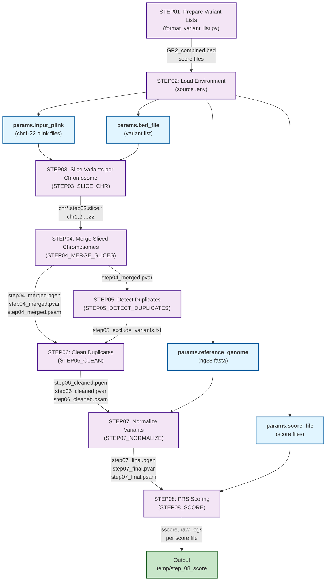

## PRS calculation pipeline for GP2 imputed genotypes

This pipeline builds simple PRS from independent GWAS hits using `plink2 --score` and also generates the raw file with individual alternative allele counts for these risk associated variants from one or more score files.
The list(s) of variants needs to be stored in the variant_list folder (not committed) and prepped one in the 'temp` folder. An example for the variant list is provided in `variant_list/example.txt` and the formatting script `code/format_variant_list.py` prepares the combined BED file and score files consumed by the pipeline.

### Environment setup

The pipeline reads key values from your environment (typically loaded via `.env`) and uses them to resolve storage paths, cloud execution settings, and input locations.

- `STORE_ROOT`: root output location for published results and Nextflow work directories (for example, a GCS bucket prefix).
- `PROJECT_NAME`: project-specific output folder under `STORE_ROOT`.
- `HG38_REF`: path to hg38 FASTA reference used for normalization; `<HG38_REF>.fai` must exist.
- `GP2_RELEASE`: base path used to build default chromosome inputs as `${GP2_RELEASE}/imputed_genotypes/EUR/chr{1..22}_EUR_release11_vwb`.
- `GOOGLE_CLOUD_PROJECT`: GCP project for `google-batch` execution.
- `GOOGLE_CLOUD_REGION`: region for Google Batch jobs (for example `us-central1`).

If any required runtime parameters are missing, `main.nf` fails early with a clear missing-parameter message.

Because `.env` is not committed, each user must create their own local environment file with project-specific values. A minimal local template is:

```dotenv
STORE_ROOT=gs://<your-bucket-or-root-prefix>
PROJECT_NAME=<your-project-name>
HG38_REF=<absolute-path-or-cloud-path-to-hg38-fasta>
GP2_RELEASE=<base-path-to-gp2-release-for-genetic-inputs>
GOOGLE_CLOUD_PROJECT=<your-gcp-project-id>
GOOGLE_CLOUD_REGION=<your-gcp-region>
```

Notes:
- Keep `.env` local/private and never commit credentials or secrets.
- `input_plink` and `score_file` have defaults in `nextflow.config`; they can be overridden when needed, but the default path construction depends on `GP2_RELEASE`.
- If your storage layout differs, provide explicit `input_plink`, `bed_file`, or `score_file` overrides at runtime.

### Inputs and required parameters
`nextflow.config` defines defaults for these parameters, but they can be overridden at runtime:
- `input_plink`: list of chromosome plink prefixes (`.pgen/.pvar/.psam`).
- `bed_file`: variant extract list in BED-like format (generated from your variant list preparation step).
- `reference_genome`: hg38 FASTA path; the matching `.fai` index is required.
- `score_file`: one or more `.score` files for PRS scoring.
- `store_root`, `project_name`: control the output/publish location.

## Usage
```
# step 1
mkdir -p temp
python code/format_variant_list.py

# step 2
source .env

# step 3-8
nextflow run main.nf -resume
````
Add `-with-tower` to the last command to enable Nextflow Tower monitoring if configured.

## Workflow Graph



## Workflow overview

#### Step 01: Prepare variant lists
- Source variant lists are expected from your `variant_list` inputs.
- `code/format_variant_list.py` prepares the files consumed by the pipeline.
- Main artifacts created in `temp/` are:
- `GP2_combined.bed` for variant extraction in Step 03.
- One or more PRS `.score` files used by Step 08.

#### Step 02: Load project environment
- Load your local environment values before starting the workflow so runtime parameters resolve correctly.
- This step supplies storage paths, reference path, GP2 release base path, and Google Batch settings used by all downstream processes.

#### Step 03: Slice variants per chromosome (`STEP03_SLICE_CHR`)
- Filters each chromosome dataset down to variants present in `bed_file`.
- Produces per-chromosome sliced plink files: `chr*.step03.slice.pgen/.pvar/.psam`.
- If a chromosome has no variants after filtering, it is skipped cleanly.
- Published under `temp/step_03_slice`.

#### Step 04: Merge sliced chromosomes (`STEP04_MERGE_SLICES`)
- Collects all successful slice outputs.
- Builds `step04_merge_list.txt` and merges all slices into one dataset.
- Produces `step04_merged.pgen/.pvar/.psam`.
- Published under `temp/step_04_merge`.

#### Step 05: Detect typed/imputed duplicates (`STEP05_DETECT_DUPLICATES`)
- Runs `code/detect_dup_typed_imputed.py` on `step04_merged.pvar`.
- Produces duplicate exclusion list `step05_exclude_variants.txt`.
- Produces run log `step05_detect_duplicates.log`.
- Published under `temp/step_05_detect_duplicates`.

#### Step 06: Remove duplicate variants (`STEP06_CLEAN`)
- Applies the exclude list from Step 05 to the merged plink dataset.
- Produces cleaned dataset `step06_cleaned.pgen/.pvar/.psam` and log.
- Published under `temp/step_06_clean`.

#### Step 07: Normalize and canonicalize variants (`STEP07_NORMALIZE`)
- Converts cleaned plink data to VCF.
- Harmonizes chromosome naming when reference index uses `chr*` format.
- Left-normalizes against hg38 reference FASTA.
- Converts normalized VCF back to plink and sets IDs to `chr:pos:ref:alt`.
- Produces `step07_normalized.vcf` and final plink set `step07_final.pgen/.pvar/.psam`.
- Published under `temp/step_07_normalize`.

#### Step 08: PRS scoring (`STEP08_SCORE`)
- Uses `step07_final` as the scoring input.
- Runs each provided `.score` file independently.
- Produces per-score outputs `${score_name}.sscore`, `${score_name}.raw`, `${score_name}.score.log`, and `${score_name}.export.log`.
- Published under `temp/step_08_score`.

### Output structure

Published outputs are organized under this base path:

`$STORE_ROOT/$PROJECT_NAME/temp`

```
temp/
  step_03_slice/
    chr*.step03.slice.pgen/.pvar/.psam
  step_04_merge/
    step04_merge_list.txt
    step04_merged.pgen/.pvar/.psam
  step_05_detect_duplicates/
    step05_exclude_variants.txt
    step05_detect_duplicates.log
  step_06_clean/
    step06_cleaned.pgen/.pvar/.psam
    step06_cleaned.log
  step_07_normalize/
    step07_normalized.vcf
    step07_final.pgen/.pvar/.psam
    step07_final.log
  step_08_score/
    <score_name>.sscore
    <score_name>.sscore.vars
    <score_name>.raw
    <score_name>.score.log
    <score_name>.export.log    
```
